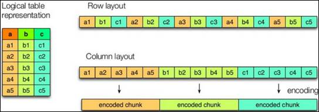
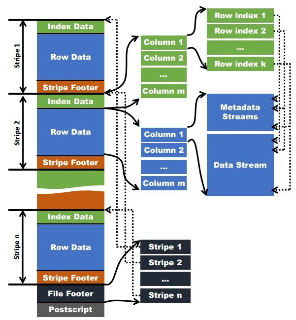
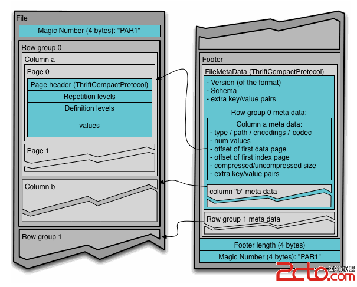

# 文件存储格式

***

## 存储格式简介

>Hive支持的存储数据的格式主要有：**TEXTFILE** 、**SEQUENCEFILE**、**ORC**、**PARQUET**。
>
>### 列式存储和行式存储
>
>
>
>如图所示左边为逻辑表，右边第一个为行式存储，第二个为列式存储。
>
>**行存储的特点**
>
>查询满足条件的一整行数据的时候，列存储则需要去每个聚集的字段找到对应的每个列的值，行存储只需要找到其中一个值，其余的值都在相邻地方，所以此时行存储查询的速度更快。
>
>**列存储的特点**
>
>因为每个字段的数据聚集存储，在查询只需要少数几个字段的时候，能大大减少读取的数据量；每个字段的数据类型一定是相同的，列式存储可以针对性的设计更好的设计压缩算法。
>
>TEXTFILE和SEQUENCEFILE的存储格式都是基于行存储的；
>
>ORC和PARQUET是基于列式存储的。

## 存储格式详解

>###  TextFile格式
>
>默认格式，数据不做压缩，磁盘开销大，数据解析开销大。可结合Gzip、Bzip2使用，但使用Gzip这种方式，hive不会对数据进行切分，从而无法对数据进行并行操作。
>
>###  Orc格式
>
>Orc (Optimized Row Columnar)是Hive 0.11版里引入的新的存储格式。
>
>如下图所示可以看到每个Orc文件由1个或多个stripe组成，每个stripe一般为HDFS的块大小，每一个stripe包含多条记录，这些记录按照列进行独立存储，对应到Parquet中的row group的概念。每个Stripe里有三部分组成，分别是Index Data，Row Data，Stripe Footer：
>
>
>
>1）Index Data：一个轻量级的index，默认是每隔1W行做一个索引。这里做的索引应该只是记录某行的各字段在Row Data中的offset。
>
>2）Row Data：存的是具体的数据，先取部分行，然后对这些行按列进行存储。对每个列进行了编码，分成多个Stream来存储。
>
>3）Stripe Footer：存的是各个Stream的类型，长度等信息。
>
>每个文件有一个File Footer，这里面存的是每个Stripe的行数，每个Column的数据类型信息等；每个文件的尾部是一个PostScript，这里面记录了整个文件的压缩类型以及FileFooter的长度信息等。在读取文件时，会seek到文件尾部读PostScript，从里面解析到File Footer长度，再读FileFooter，从里面解析到各个Stripe信息，再读各个Stripe，即从后往前读。
>
>### 9.4.4 Parquet格
>
>Parquet文件是以二进制方式存储的，所以是不可以直接读取的，文件中包括该文件的数据和元数据，因此Parquet格式文件是自解析的。
>
>（1）行组(Row Group)：每一个行组包含一定的行数，在一个HDFS文件中至少存储一个行组，类似于orc的stripe的概念。
>
>（2）列块(Column Chunk)：在一个行组中每一列保存在一个列块中，行组中的所有列连续的存储在这个行组文件中。一个列块中的值都是相同类型的，不同的列块可能使用不同的算法进行压缩。
>
>（3）页(Page)：每一个列块划分为多个页，一个页是最小的编码的单位，在同一个列块的不同页可能使用不同的编码方式。
>
>通常情况下，在存储Parquet数据的时候会按照hdfs Block大小设置行组的大小，由于一般情况下每一个Mapper任务处理数据的最小单位是一个Block，这样可以把每一个行组由一个Mapper任务处理，增大任务执行并行度。Parquet文件的格式。
>
>
>
>上图展示了一个Parquet文件的内容，一个文件中可以存储多个行组，文件的首位都是该文件的Magic Code，用于校验它是否是一个Parquet文件，Footer length记录了文件元数据的大小，通过该值和文件长度可以计算出元数据的偏移量，文件的元数据中包括每一个行组的元数据信息和该文件存储数据的Schema信息。除了文件中每一个行组的元数据，每一页的开始都会存储该页的元数据，在Parquet中，有三种类型的页：数据页、字典页和索引页。数据页用于存储当前行组中该列的值，字典页存储该列值的编码字典，每一个列块中最多包含一个字典页，索引页用来存储当前行组下该列的索引，目前Parquet中还不支持索引页。
>
>#### 存储文件的对比总结：
>
>ORC > Parquet > textFile
>
>#### 存储文件的查询速度总结：
>
>查询速度相近。

## 存储和压缩结合

>### 测试存储和压缩
>
>官网：https://cwiki.apache.org/confluence/display/Hive/LanguageManual+ORC
>
>ORC存储方式的压缩：
>
>| Key                      | Default     | Notes                                                        |
>| ------------------------ | ----------- | ------------------------------------------------------------ |
>| orc.compress             | ZLIB        | high level  compression (one of NONE, ZLIB, SNAPPY)          |
>| orc.compress.size        | 262,144     | number of bytes  in each compression chunk                   |
>| orc.stripe.size          | 268,435,456 | number of bytes in each stripe                               |
>| orc.row.index.stride     | 10,000      | number of rows between index entries (must be >= 1000)       |
>| orc.create.index         | true        | whether to create  row indexes                               |
>| orc.bloom.filter.columns | ""          | comma separated list of column names for which bloom filter should be  created |
>| orc.bloom.filter.fpp     | 0.05        | false positive probability for bloom filter (must >0.0 and <1.0) |
>
>注意：所有关于ORCFile的参数都是在HQL语句的TBLPROPERTIES字段里面出现
>
>**1）创建一个ZLIB压缩的ORC存储方式**
>
>（1）建表语句
>
>```sql
>create table log_orc_zlib(
>track_time string,
>url string,
>session_id string,
>referer string,
>ip string,
>end_user_id string,
>city_id string
>)
>row format delimited fields terminated by '\t'
>stored as orc
>tblproperties("orc.compress"="ZLIB");
>```
>
>（2）插入数据
>
>insert into log_orc_zlib select * from log_text;
>
>​     
>
>（3）查看插入后数据
>
>hive (default)> dfs -du -h /user/hive/warehouse/log_orc_zlib/ ;
>
>​     
>
>2.78 M /user/hive/warehouse/log_orc_none/000000_0
>
>**2）创建一个SNAPPY压缩的ORC存储方式**
>
>（1）建表语句
>
>```sql
>create table log_orc_snappy(
>track_time string,
>url string,
>session_id string,
>referer string,
>ip string,
>end_user_id string,
>city_id string
>)
>row format delimited fields terminated by '\t'
>stored as orc
>tblproperties("orc.compress"="SNAPPY");
>```
>
>​     
>
>（2）插入数据
>
>insert into log_orc_snappy select * from log_text;
>
>​     
>
>（3）查看插入后数据
>
>hive (default)> dfs -du -h /user/hive/warehouse/log_orc_snappy/ ;
>
>3.75 M  /user/hive/warehouse/log_orc_snappy/000000_0
>
>ZLIB比Snappy压缩的还小。原因是ZLIB采用的是deflate压缩算法。比snappy压缩的压缩率高。
>
>**3）创建一个SNAPPY压缩的parquet存储方式**
>
>（1）建表语句
>
>```sql
>create table log_parquet_snappy(
>track_time string,
>url string,
>session_id string,
>referer string,
>ip string,
>end_user_id string,
>city_id string
>)
>row format delimited fields terminated by '\t'
>stored as parquet
>tblproperties("parquet.compression"="SNAPPY");
>```
>
>​     
>
>（2）插入数据
>
>insert into log_parquet_snappy select * from log_text;
>
>​     
>
>（3）查看插入后数据
>
>hive (default)> dfs -du -h /user/hive/warehouse/log_parquet_snappy / ;
>
>6.39 MB  /user/hive/warehouse/ log_parquet_snappy /000000_0
>
> 
>
>**4）存储方式和压缩总结**
>
>**在实际的项目开发当中，hive表的数据存储格式一般选择：orc或parquet。压缩方式一般选择snappy，lzo。**
>
>